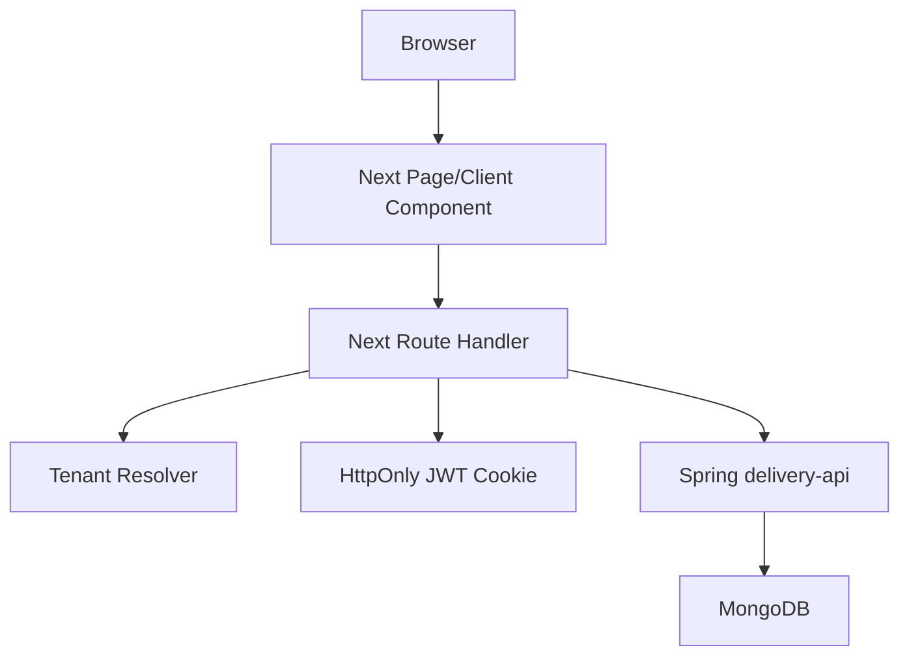

# Frontend Foundation Design

**Spec**: `.specs/features/frontend-foundation/spec.md`
**Status**: Draft

---

## Architecture Overview

Browser renders Next UI and calls same-origin Route Handlers. Route Handlers resolve tenant and forward requests to Spring backend with `X-Tenant-Slug`; admin token is read from HttpOnly cookie server-side.

---

## Components

### Tenant Resolver

- **Purpose**: Extract tenant from host/subdomain or fallback env.
- **Location**: `src/utils/tenant.ts`
- **Interfaces**:
  - `resolveTenantFromHost(host?: string): string`
  - `resolveTenantFromHeaders(headers: Headers): string`

### Backend Proxy

- **Purpose**: Same-origin BFF for public/admin backend calls.
- **Location**: `src/app/api/backend/[...path]/route.ts`
- **Interfaces**: GET, POST, PUT, PATCH, DELETE.

### Auth Route Handlers

- **Purpose**: Login/logout/me while keeping JWT HttpOnly.
- **Location**: `src/app/api/auth/**/route.ts`

### Theme

- **Purpose**: Apply `primaryColor` and `secondaryColor`.
- **Location**: `src/components/ThemeProvider/`

### Customer App

- **Purpose**: Menu, product options, cart and checkout.
- **Location**: `src/views/Home/`

### Admin App

- **Purpose**: Login, dashboard, orders, kitchen, catalog and settings.
- **Location**: `src/views/Admin*/`

### Admin Layout

- **Purpose**: Protected admin shell, navigation and logout.
- **Location**: `src/layouts/AdminLayout/`

### API Services

- **Purpose**: Frontend API client and server-side backend calls.
- **Location**: `src/services/api/`

### Shared UI Components

- **Purpose**: Reusable UI components.
- **Location**: `src/components/[ComponentName]/`
- **Files**: `index.tsx` plus `types.ts` when the component exposes props.

---

## Data Models

Types mirror backend DTOs in `src/types/api.ts`.

---

## Tech Decisions

| Decision | Choice | Rationale |
| --- | --- | --- |
| Admin token | HttpOnly cookie | Avoid exposing JWT to browser JS |
| API access | Next Route Handlers | Avoid CORS and centralize tenant header |
| Forms | React Hook Form + Zod | Required and predictable validation |
| Theme | CSS variables | Fast runtime tenant color changes |
| Frontend organization | Layer-based structure: `app`, `views`, `components`, `layouts`, `services`, `utils`, `constants`, `types` | Matches Cosmos architecture by technical responsibility |
