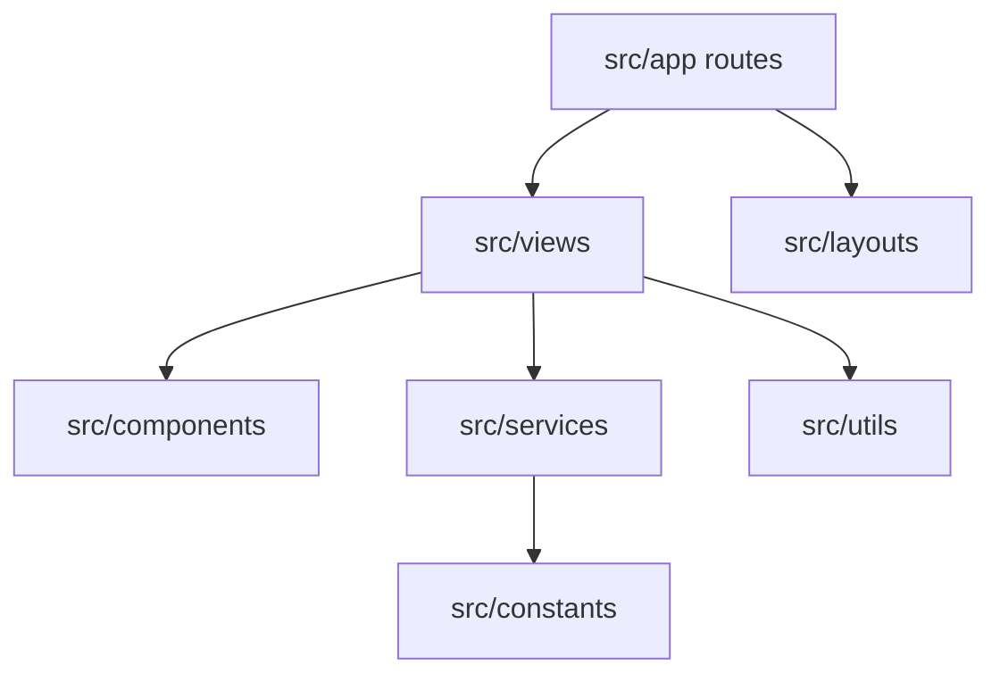

# Frontend Organization Design

**Spec**: `.specs/features/frontend-organization/spec.md`
**Status**: Approved

---

## Architecture Overview

Keep Next App Router for routing, but organize source code by technical layer, matching the dominant Cosmos project pattern.

---

## Layers

### Routes

- **Purpose**: Next App Router route files and Route Handlers.
- **Location**: `src/app/`

### Views

- **Purpose**: Screen/container code for public and admin pages.
- **Location**: `src/views/[ViewName]/`

### Components

- **Purpose**: Reusable UI components.
- **Location**: `src/components/[ComponentName]/`

### Layouts

- **Purpose**: Shared layout shells.
- **Location**: `src/layouts/[LayoutName]/`

### Services

- **Purpose**: API clients and server-side integration code.
- **Location**: `src/services/`

### Support

- **Purpose**: Shared constants, helpers and DTO types.
- **Location**: `src/constants/`, `src/utils/`, `src/types/`

---

## Tech Decisions

| Decision | Choice | Rationale |
| --- | --- | --- |
| Router | Keep App Router | Existing project uses Next 16 App Router |
| Organization | Layer-based by technical responsibility | Matches Cosmos dominant architecture |
| Components | Only reusable UI under `src/components` | Avoid page-local component folder sprawl |
